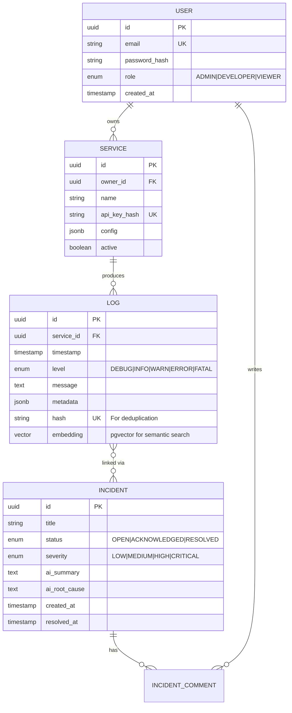

# Intelligent Incident & Log Management Platform

## Architecture & Implementation Plan (Portfolio Edition)

> **Goal**: Build a production-grade, AI-powered observability platform that demonstrates mastery of backend engineering, distributed systems, and AI integration—skills essential for a Full-Stack Engineer in 2026.

---

## 1. Problem Statement & Vision

Modern microservices generate massive log volumes. Engineers struggle to find the "needle in the haystack" when incidents occur. This platform addresses that by:

1.  **Centralizing** logs from multiple services.
2.  **Correlating** related events automatically (e.g., cascading errors).
3.  **Summarizing** incidents using AI, reducing Mean Time To Resolution (MTTR).
4.  **Providing Observability** through real-time dashboards and alerting.

**Why This Project Stands Out (2026 Fresher Perspective):**

| Skill Area                            | Demonstrated Concept                                         |
| ------------------------------------- | ------------------------------------------------------------ |
| **Distributed Systems**               | Event-driven architecture, message queues, idempotency       |
| **AI/ML Integration**                 | RAG for incident context, semantic search, LLM summarization |
| **Observability (Industry Standard)** | OpenTelemetry, structured logging, metrics, tracing          |
| **Security**                          | JWT, RBAC, API key rotation, secrets management              |
| **DevOps/SRE**                        | Docker, CI/CD, health checks, graceful degradation           |
| **Performance**                       | Caching (Redis), database indexing, async processing         |

---

## 2. Technology Stack (Justified Selection)

### Backend

| Component     | Choice                | Rationale (Why This Over Alternatives?)                                                                               |
| ------------- | --------------------- | --------------------------------------------------------------------------------------------------------------------- |
| **Runtime**   | **Node.js (v20 LTS)** | Non-blocking I/O ideal for high-throughput log ingestion.                                                             |
| **Framework** | **NestJS**            | Opinionated, enterprise-grade. Supports DI, Modules, Guards. Better than Express for large projects due to structure. |
| **Language**  | **TypeScript**        | End-to-end type safety. Shared interfaces between backend & frontend reduce bugs.                                     |
| **ORM**       | **Prisma**            | Type-safe database access, schema migrations, better DX than TypeORM.                                                 |

### Database & Storage

| Component         | Choice                    | Rationale                                                                             |
| ----------------- | ------------------------- | ------------------------------------------------------------------------------------- |
| **Primary DB**    | **PostgreSQL 16**         | ACID compliance, JSONB for flexible metadata, full-text search for logs.              |
| **Vector Store**  | **pgvector (Extension)**  | Semantic search for logs. No need for separate Pinecone/Qdrant—simplifies deployment. |
| **Cache**         | **Redis**                 | Session caching, rate limiting, pub/sub for real-time features.                       |
| **Message Queue** | **BullMQ (Redis-backed)** | Async job processing for AI summarization. Simpler than RabbitMQ for this scale.      |

### AI/ML

| Component      | Choice                         | Rationale                                                                      |
| -------------- | ------------------------------ | ------------------------------------------------------------------------------ |
| **LLM**        | **Ollama + Llama 3.2 (Local)** | Zero cost, privacy-preserving. Demonstrates ability to work with local models. |
| **Framework**  | **LangChain.js**               | Simplifies prompt chaining, RAG pipelines, and tool use.                       |
| **Embeddings** | **all-MiniLM-L6-v2**           | Fast, lightweight embeddings for semantic log search.                          |

### Frontend

| Component     | Choice                       | Rationale                                            |
| ------------- | ---------------------------- | ---------------------------------------------------- |
| **Framework** | **React 19 + Vite**          | Industry standard. Fast HMR, modern tooling.         |
| **Styling**   | **Tailwind CSS + shadcn/ui** | Rapid development, consistent design system.         |
| **State**     | **TanStack Query**           | Server-state management, caching, real-time polling. |
| **Charts**    | **Recharts**                 | Lightweight, React-native charting.                  |

### DevOps & Infrastructure

| Component            | Choice                      | Rationale                                        |
| -------------------- | --------------------------- | ------------------------------------------------ |
| **Containerization** | **Docker + Docker Compose** | Reproducible environments. Single-command setup. |
| **CI/CD**            | **GitHub Actions**          | Industry standard, free for public repos.        |
| **API Docs**         | **Swagger/OpenAPI**         | Auto-generated, interactive documentation.       |

---

## 3. System Architecture

### 3.1 High-Level Design

```
┌─────────────────────────────────────────────────────────────────────────────┐
│                              CLIENT LAYER                                    │
├─────────────────────────────────────────────────────────────────────────────┤
│  React Dashboard        SDK/Agent (Future)        Webhooks (Incoming)       │
└────────────┬───────────────────┬──────────────────────┬─────────────────────┘
             │ REST/WebSocket    │ REST                  │ REST
             ▼                   ▼                       ▼
┌─────────────────────────────────────────────────────────────────────────────┐
│                            API GATEWAY LAYER                                 │
│         (NestJS Guards: Auth, Rate Limiting, Validation)                     │
└────────────┬───────────────────┬──────────────────────┬─────────────────────┘
             │                   │                       │
┌────────────▼────────┐  ┌───────▼───────┐  ┌───────────▼─────────┐
│  INGESTION MODULE   │  │ QUERY MODULE  │  │  INCIDENT MODULE    │
│  - Validate logs    │  │ - Search logs │  │  - CRUD incidents   │
│  - Emit events      │  │ - Aggregations│  │  - Lifecycle mgmt   │
│  - Dead letter Q    │  │ - Export      │  │  - Trigger AI jobs  │
└────────────┬────────┘  └───────┬───────┘  └───────────┬─────────┘
             │ Event              │ Read                 │ Event
             ▼                    ▼                      ▼
┌─────────────────────────────────────────────────────────────────────────────┐
│                          PROCESSING LAYER (Async)                            │
│  BullMQ Jobs: Normalization, Correlation, Anomaly Detection, AI Summary     │
└─────────────────────────────────────────────────────────────────────────────┘
             │ Write                                     │ Embed
             ▼                                           ▼
┌─────────────────────────────────────────────────────────────────────────────┐
│                            PERSISTENCE LAYER                                 │
│           PostgreSQL (Logs, Incidents, Users) + pgvector (Embeddings)        │
└─────────────────────────────────────────────────────────────────────────────┘
```

> **Diagram Editor:** [Eraser.io Mermaid Editor](https://www.eraser.io/ai/mermaid-diagram-editor)

### 3.2 Key Architectural Patterns Demonstrated

| Pattern                       | Application                                                 | Why It Matters                                 |
| ----------------------------- | ----------------------------------------------------------- | ---------------------------------------------- |
| **Event-Driven Architecture** | Ingestion emits `LogReceived` event → Processing subscribes | Decouples components, enables async processing |
| **CQRS (Lite)**               | Separate write (Ingestion) and read (Query) endpoints       | Optimizes for different use cases              |
| **Dead Letter Queue**         | Malformed logs saved for manual review                      | Zero data loss, operational resilience         |
| **Circuit Breaker**           | AI service calls wrapped with retry + fallback              | Prevents cascade failures if LLM is slow/down  |
| **Idempotency**               | Log deduplication using content hash                        | Handles duplicate submissions gracefully       |

---

## 4. Data Model Design

### 4.1 Entity Relationship Diagram



### 4.2 Indexing Strategy (Performance Optimization)

| Table       | Index                          | Purpose                                          |
| ----------- | ------------------------------ | ------------------------------------------------ |
| `logs`      | `(service_id, timestamp DESC)` | Fast service-specific log queries                |
| `logs`      | `GIN(metadata)`                | JSONB key/value searches                         |
| `logs`      | `HNSW(embedding)`              | Approximate nearest neighbor for semantic search |
| `incidents` | `(status, severity)`           | Dashboard filtering                              |

---

## 5. API Design

### 5.1 RESTful Endpoints

| Method  | Endpoint                    | Description                            | Auth        |
| ------- | --------------------------- | -------------------------------------- | ----------- |
| `POST`  | `/v1/ingest`                | Receive logs (single or batch)         | API Key     |
| `GET`   | `/v1/logs`                  | Search logs with filters               | JWT         |
| `POST`  | `/v1/logs/search`           | Semantic search using natural language | JWT         |
| `GET`   | `/v1/incidents`             | List incidents                         | JWT         |
| `POST`  | `/v1/incidents/:id/analyze` | Trigger AI analysis                    | JWT (Admin) |
| `PATCH` | `/v1/incidents/:id/status`  | Update incident status                 | JWT         |
| `WS`    | `/live/logs`                | Real-time log streaming                | JWT         |

### 5.2 Request/Response Examples

**Log Ingestion (Batch):**

```json
POST /v1/ingest
Headers: { "X-API-Key": "svc_xxx" }
Body: {
  "logs": [
    {
      "timestamp": "2026-02-09T14:30:00Z",
      "level": "ERROR",
      "message": "Payment failed: timeout connecting to Stripe",
      "metadata": { "user_id": "u_123", "trace_id": "abc-xyz" }
    }
  ]
}
Response: { "received": 1, "duplicates_skipped": 0 }
```

---

## 6. AI Integration Deep Dive

### 6.1 Incident Summarization Pipeline

```
┌─────────────┐    ┌──────────────┐    ┌───────────────┐    ┌─────────────┐
│ Incident    │───►│ Fetch Related│───►│ Build Prompt  │───►│ LLM (Ollama)│
│ Created     │    │ Logs (Last   │    │ with Context  │    │ + LangChain │
│ Event       │    │ 30 mins)     │    │               │    │             │
└─────────────┘    └──────────────┘    └───────────────┘    └──────┬──────┘
                                                                   │
                                       ┌───────────────────────────┘
                                       ▼
                                ┌─────────────┐
                                │ Store       │
                                │ Summary +   │
                                │ Root Cause  │
                                └─────────────┘
```

### 6.2 Prompt Engineering Template

```
You are an expert SRE analyzing a production incident.

**Service:** {service_name}
**Time Range:** {start_time} to {end_time}
**Severity:** {severity}

**Recent Logs:**
{log_entries}

**Task:**
1. Summarize what happened in 2-3 sentences.
2. Identify the most likely root cause.
3. Suggest 2-3 remediation steps.

Respond in JSON format:
{ "summary": "...", "root_cause": "...", "remediation": ["..."] }
```

### 6.3 Semantic Search (RAG-Lite)

1.  User asks: _"Show me all database connection errors from last week"_
2.  Generate embedding for the query using `all-MiniLM-L6-v2`
3.  Perform vector similarity search on `logs.embedding` column
4.  Return top-K matching logs with relevance scores

---

## 7. Security Implementation

| Concern              | Solution                                           |
| -------------------- | -------------------------------------------------- |
| **Authentication**   | JWT with refresh tokens (15min access, 7d refresh) |
| **Authorization**    | RBAC with NestJS Guards (Admin, Developer, Viewer) |
| **API Keys**         | Hashed storage (bcrypt), rotation support          |
| **Rate Limiting**    | Per-endpoint limits using `@nestjs/throttler`      |
| **Input Validation** | DTOs with `class-validator`, sanitization          |
| **Secrets**          | Environment variables, `.env` files (dotenv)       |

---

## 8. DevOps & Deployment

### 8.1 Docker Compose Setup

```yaml
services:
  api:
    build: ./backend
    ports: ["3000:3000"]
    depends_on: [postgres, redis, ollama]

  frontend:
    build: ./frontend
    ports: ["5173:80"]

  postgres:
    image: pgvector/pgvector:pg16
    volumes: [pg_data:/var/lib/postgresql/data]

  redis:
    image: redis:7-alpine

  ollama:
    image: ollama/ollama
    volumes: [ollama_data:/root/.ollama]
```

### 8.2 CI/CD Pipeline (GitHub Actions)

```yaml
jobs:
  test:
    runs-on: ubuntu-latest
    steps:
      - uses: actions/checkout@v4
      - run: npm ci && npm test

  build:
    needs: test
    runs-on: ubuntu-latest
    steps:
      - run: docker build -t ghcr.io/${{ github.repository }}:${{ github.sha }} .
      - run: docker push ghcr.io/${{ github.repository }}:${{ github.sha }}
```

---

## 9. Metrics & Observability (Self-Eating Dog Food)

The platform will instrument **itself** using the same patterns it recommends:

| Metric                        | Description                  |
| ----------------------------- | ---------------------------- |
| `logs_ingested_total`         | Counter of logs received     |
| `ingestion_latency_ms`        | Histogram of processing time |
| `ai_summary_duration_seconds` | LLM response time            |
| `incident_mttr_hours`         | Mean time to resolve         |

Exposed via `/metrics` endpoint (Prometheus format).

---

## 10. Implementation Roadmap

### Phase 1: Foundation (Week 1-2)

- [ ] NestJS project setup with modular architecture
- [ ] PostgreSQL + pgvector + Prisma schema
- [ ] JWT authentication & RBAC guards
- [ ] Basic log ingestion endpoint with validation

### Phase 2: Core Features (Week 3-4)

- [ ] Log storage with deduplication
- [ ] Incident management CRUD
- [ ] Correlation engine (group errors by trace_id)
- [ ] WebSocket gateway for live logs

### Phase 3: AI Integration (Week 5-6)

- [ ] Ollama integration with LangChain.js
- [ ] Incident summarization job (BullMQ)
- [ ] Semantic search with embeddings
- [ ] Prompt templates & testing

### Phase 4: Frontend & Polish (Week 7-8)

- [ ] React dashboard with incident timeline
- [ ] Log viewer with filters & search
- [ ] Real-time incident updates
- [ ] Docker Compose production setup

---

## 11. Demonstrable Skills Summary

| Category         | Specific Skills                                       |
| ---------------- | ----------------------------------------------------- |
| **Backend**      | REST API design, TypeScript, NestJS, ORMs, validation |
| **Database**     | PostgreSQL, indexing, JSONB, vector search            |
| **AI/ML**        | LLM integration, prompt engineering, RAG, embeddings  |
| **Security**     | JWT, RBAC, API keys, rate limiting                    |
| **Architecture** | Event-driven, CQRS, async jobs, idempotency           |
| **DevOps**       | Docker, CI/CD, observability, health checks           |
| **Frontend**     | React, state management, real-time updates            |

---

## 12. Stretch Goals (Bonus Points)

- [ ] **Chaos Engineering Mode**: Flag to simulate failures for resilience testing
- [ ] **Natural Language Querying**: "Show errors from payment service yesterday"
- [ ] **Slack/Discord Integration**: Incident notifications
- [ ] **Multi-tenancy**: Isolated data per organization
- [ ] **OpenTelemetry Export**: Send telemetry to external tools

---

> **Document Version:** 2.0 | **Last Updated:** 2026-02-09
